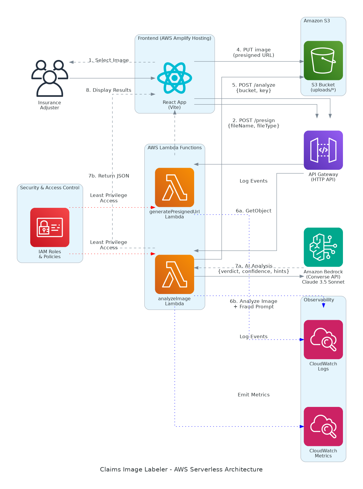

# Claims Image Labeler v2

A serverless AWS-based solution for detecting AI-generated or manipulated images in insurance claims using Amazon Bedrock AI.

## Overview

This system helps insurance carriers reduce claim fraud by analyzing uploaded images to determine if they were AI-generated or digitally manipulated. Adjusters upload photos of vehicles, property, etc., and the system quickly provides a verdict with human-readable analysis notes.

## Architecture Diagram



The architecture diagram above illustrates the complete serverless solution deployed on AWS.

## Architecture Components

### Frontend
- **AWS Amplify Hosting**: Hosts the React (Vite) web application
- **React Web App**: Simple UI for uploading images and viewing analysis results

### API Layer
- **Amazon API Gateway (HTTP API)**: Exposes two endpoints:
  - `POST /presign` → Triggers `generatePresignedUrl` Lambda
  - `POST /analyze` → Triggers `analyzeImage` Lambda

### Compute
- **generatePresignedUrl Lambda** (Python): Generates secure, temporary S3 upload URLs
- **analyzeImage Lambda** (Python): Retrieves images from S3 and sends them to Bedrock for AI analysis

### Storage
- **Amazon S3**: Stores uploaded images in the `uploads/` prefix with:
  - Block Public Access enabled
  - Server-Side Encryption (SSE-S3)
  - CORS configured for Amplify domain

### AI/ML
- **Amazon Bedrock (Converse API)**: Uses multimodal AI models (Claude 3.5 Sonnet or Amazon Nova Understanding) to analyze images and detect AI generation or manipulation

### Observability
- **CloudWatch Logs**: Structured JSON logs from Lambda functions
- **CloudWatch Metrics**: Custom metrics for verdicts, confidence scores, and errors

### Security
- **IAM Roles & Policies**: Least privilege access control
  - `generatePresignedUrl` → `s3:PutObject` for `uploads/*`
  - `analyzeImage` → `s3:GetObject` for `uploads/*` and `bedrock:InvokeModel*`

## Data Flow

1. **User selects an image** in the React web app
2. **React calls** `POST /presign` with `{fileName, fileType}`
3. **Lambda generates** a presigned S3 URL and returns `{url, key, bucket}`
4. **Browser uploads** the image directly to S3 using the presigned URL
5. **React calls** `POST /analyze` with `{bucket, key}`
6. **analyzeImage Lambda**:
   - Retrieves the image from S3
   - Sends it to Amazon Bedrock with a fraud detection prompt
   - Receives AI analysis with verdict, confidence, and hints
7. **Lambda returns** the analysis JSON to the frontend
8. **React displays** the verdict, confidence score, and analysis hints

## API Contracts

### POST /presign
**Request:**
```json
{
  "fileName": "vehicle_damage.jpg",
  "fileType": "image/jpeg"
}
```

**Response:**
```json
{
  "url": "https://bucket.s3.amazonaws.com/uploads/12345-vehicle_damage.jpg?X-Amz-...",
  "key": "uploads/12345-vehicle_damage.jpg",
  "bucket": "claims-images-bucket"
}
```

### POST /analyze
**Request:**
```json
{
  "bucket": "claims-images-bucket",
  "key": "uploads/12345-vehicle_damage.jpg"
}
```

**Response:**
```json
{
  "verdict": "AI_GENERATED",
  "confidence": 0.92,
  "hints": [
    "repeating texture in shadows",
    "edge halos around objects",
    "inconsistent reflections",
    "unnatural lighting gradients"
  ]
}
```

Possible `verdict` values:
- `AI_GENERATED`: Image appears to be AI-generated
- `LIKELY_REAL`: Image appears to be authentic
- `INCONCLUSIVE`: Unable to make a determination

## Security Features

### S3 Security
- **Block Public Access**: Enabled on bucket
- **Server-Side Encryption**: SSE-S3 for all objects
- **CORS Configuration**: Limited to Amplify domain
```json
[
  {
    "AllowedOrigins": ["https://<your-amplify-domain>"],
    "AllowedMethods": ["PUT", "GET", "HEAD"],
    "AllowedHeaders": ["Content-Type"],
    "ExposeHeaders": ["ETag"],
    "MaxAgeSeconds": 3000
  }
]
```

### API Gateway Security
- **CORS**: Origins limited to Amplify domain
- **Request Validation**: Validates request payloads
- **Methods**: POST, OPTIONS only

### IAM Least Privilege
- **generatePresignedUrl Lambda Role**:
  - `s3:PutObject` on `arn:aws:s3:::<bucket>/uploads/*`
- **analyzeImage Lambda Role**:
  - `s3:GetObject` on `arn:aws:s3:::<bucket>/uploads/*`
  - `bedrock:InvokeModel*` on Bedrock models

## Observability

### Structured Logging
Lambdas emit structured JSON logs including:
- `requestId`: Unique request identifier
- `bucket`, `key`: S3 object details
- `model`: Bedrock model used
- `latency`: Request processing time
- `verdict`, `confidence`: Analysis results

### CloudWatch Metrics
Custom metrics tracked:
- **Verdict Distribution**: Count of AI_GENERATED, LIKELY_REAL, INCONCLUSIVE
- **Confidence Scores**: Average confidence by verdict
- **Error Rates**: Lambda and Bedrock errors
- **Latency**: P50, P90, P99 response times

## Business Value

### Problem Solved
Insurance carriers face increasing fraud from AI-generated or manipulated claim images. Manual review is slow and inconsistent.

### Solution Benefits
- **Fast Detection**: Sub-second analysis of claim images
- **Scalable**: Handles spikes in claim volume automatically
- **Cost-Effective**: Pay only for what you use (serverless)
- **Auditable**: Complete logs and metrics for compliance
- **Secure**: Enterprise-grade AWS security by default

### Use Cases
- Vehicle damage assessment
- Property damage verification
- Document authenticity checks
- Medical imaging validation

## Non-Functional Goals

✅ **Simple**: No servers to manage, fully serverless  
✅ **Low Latency**: Direct S3 uploads, efficient Lambda processing  
✅ **Low Cost**: Pay-per-use pricing, no idle resources  
✅ **Scalable**: Automatic scaling with demand  
✅ **Secure**: IAM least privilege, encryption at rest, limited CORS  
✅ **Observable**: Comprehensive logs and metrics for auditing

## Technology Stack

- **Frontend**: React 18+ with Vite
- **Cloud Provider**: AWS
- **Hosting**: AWS Amplify Hosting
- **API**: Amazon API Gateway (HTTP API)
- **Compute**: AWS Lambda (Python 3.11+)
- **Storage**: Amazon S3
- **AI/ML**: Amazon Bedrock (Claude 3.5 Sonnet / Amazon Nova Understanding)
- **Monitoring**: Amazon CloudWatch

## Future Enhancements

- Support for batch image analysis
- Historical analysis dashboard
- Integration with existing claims management systems
- Advanced analytics on fraud patterns
- Support for additional file formats (HEIC, TIFF, etc.)
- Real-time notifications for high-confidence fraud detection

## License

This project is provided as a reference architecture for building AI-powered fraud detection systems.